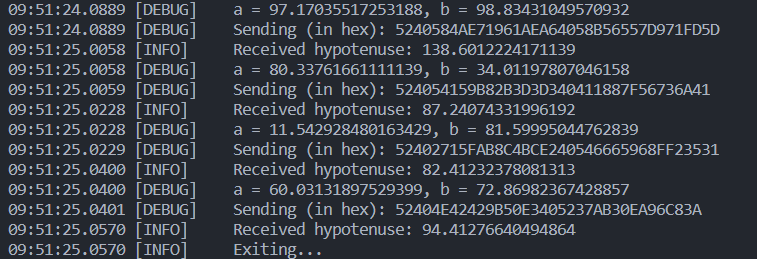

# A simple RPC demo

A simple RPC demo implemented in Go and Rust.

The server is already hosted on `test.lingkang.dev:8333` for testing.

The rustdoc of client side is hosted on [`lingkang.dev/rpc_demo/`](https://lingkang.dev/rpc_demo/client/index.html).

See this blog post for more details: [Implement RPC demo from scratch - Lingkang's Blog](https://lingkang.dev/2024/01/08/rpc/).

## Table of Contents

- [Table of Contents](#table-of-contents)
- [1. Server](#1-server)
  - [1.1. Run](#11-run)
  - [1.2. Output](#12-output)
- [2. Client](#2-client)
  - [2.1. Run](#21-run)
  - [2.2. Output](#22-output)
- [3. CLOC](#3-cloc)

## 1. Server

The server side is implemented in Go, under the `./server` directory.

### 1.1. Run

To run it locally:

``` bash
cd server
go run cmd/main.go
```

Or build and run the binary:

``` bash
cd server
go build -o target/rpc_demo cmd/main.go
./target/rpc_demo
```

Or use `nohup` to run it in the background.

``` bash
nohup ./target/rpc_demo > ./target/output.txt 2>&1 & # keep the output
# or
nohup ./target/rpc_demo > /dev/null 2>&1 & # discard the output
```

### 1.2. Output

Golang built-in module `log` is used to provide basic running information.


---

## 2. Client

The client side is implemented in Rust, under the `./client` directory.

### 2.1. Run

It can be run locally:

``` bash
cd client
cargo run
```

### 2.2. Output

A naive implementation of logger based on `log` crate is used in this demo:



---

## 3. CLOC

Count lines of code:

``` txt
-------------------------------------------------------------------------------
Language                     files          blank        comment           code
-------------------------------------------------------------------------------
Go                               5             60             50            347
Rust                             8             84            120            320
Markdown                         2             51              0            119
YAML                             2             13              2             45
PowerShell                       1              7              0              8
TOML                             1              2              1              7
-------------------------------------------------------------------------------
SUM:                            19            217            173            846
-------------------------------------------------------------------------------
```
