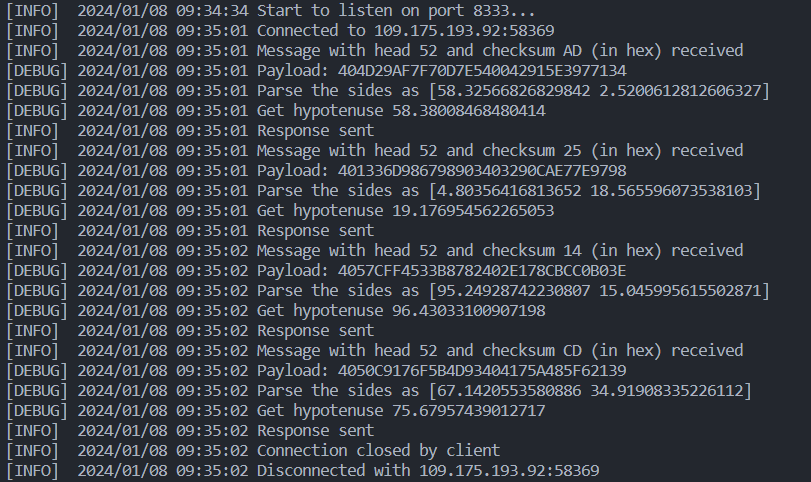

# A simple RPC demo

Remote Procedure Call (RPC)

- [1. Server](#1-server)
  - [1.1. Run](#11-run)
  - [1.2. Output](#12-output)
- [2. Client](#2-client)
  - [2.1. Run](#21-run)

## 1. Server

The server side is implemented in Go, under the `./server` directory.

### 1.1. Run

The server is already hosted on `test.lingkang.dev:8333`, but you can also run it locally:

``` bash
cd server
go run cmd/main.go
```

Or build and run the binary:

``` bash
cd server
go build -o target/rpc_demo cmd/main.go
nohup ./target/rpc_demo &
```

Use `nohup ./server/target/rpc_demo >/dev/null 2>&1 &` to discard the output.

### 1.2. Output

Golang built-in module `log` is used to provide basic running information.



---

## 2. Client

The client side is implemented in Rust, under the `./client` directory.

### 2.1. Run

It can be run locally:

``` bash
cd client
cargo run
```
